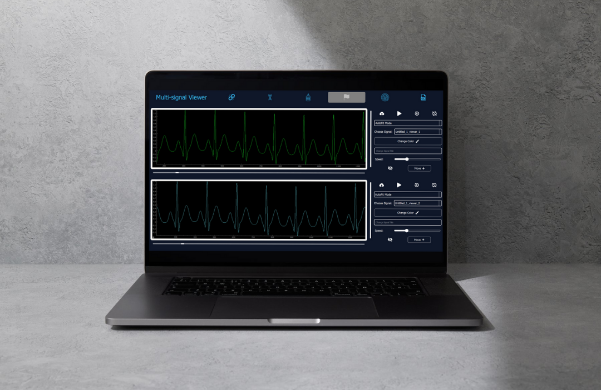

# BioSignalScope Real time biological signals viewer


## Overview
The **Multi-Signal Viewer** is a powerful desktop application designed for signal analysis with a user-friendly interface. It supports four distinct operational modes:

- **Default Mode**
- **Real-Time Mode**
- **Glowing Mode**
- **Non-Rectangular Graph Mode**

Each mode provides unique features for signal manipulation, customization, and visualization.

---

## Features

### 1. Default Mode
- **Dual Viewer Interface**:
  - Two synchronized signal viewers for simultaneous signal analysis
  - Independent signal loading in each viewer
  - Ability to transfer signals between viewers
- **Playback Controls**:
  - Play, pause, and rewind functionality
  - Adjustable playback speed
  - Zoom and pan capabilities
- **Signal Customization**:
  - Adjustable colors and names for each signal
  - Vertical and horizontal scaling via sliders
  - Show/hide signal options
- **Viewer Synchronization**:
  - Option to link viewers for synchronized control
  - Matching time scales and playback states

### Check Default Mode Demo
https://github.com/user-attachments/assets/4a2657cf-c6c3-4e9d-b31e-efa275623fab


### 2. Real-Time Mode
- **API Integration**:
  - Connect to live data sources via API link
  - Real-time signal visualization
  - Continuous data monitoring
- **Dynamic Controls**:
  - Play and pause functionality
  - Live data streaming display
### Check Real-Time Mode 


### 3. Glowing Mode
- **Signal Selection**:
  - Highlight and select specific signal segments
  - Precise control over selection boundaries
- **Segment Manipulation**:
  - Reorder selected segments freely
  - Adjust segment parameters(Interpolation order, gap or overlap)
  - Customize glowing effects
- **PDF Report Generation**:
  - Add modified segments to report
  - Generate and export professional PDF reports
### Check Glowing Mode Demo
https://github.com/user-attachments/assets/5a8fa4a9-dd70-4b6e-9a5c-7c52d0bcd621


### 4. Non-Rectangular Graph Mode
- **Specialized Visualization**:
  - Display of non-rectangular signal patterns
- **Interactive Features**:
  - Play/pause functionality
  - Speed control
  - Color customization
### Check Non-Rectangle Mode Demo
https://github.com/user-attachments/assets/5deed996-2975-421f-bb44-470d9072b078

---

## How to Use

### Default Mode
1. Launch the application.
2. Click "Browse" to load signals into either viewer.
3. Use playback controls to analyze signals:
   - Play/Pause button
   - Speed slider
   - Zoom controls
4. Customize signal display:
   - Change colors
   - Adjust scaling
   - Modify names

### Real-Time Mode
1. Switch to Real-Time Mode.
2. Enter the API link for your data source.
4. Monitor incoming signals with play and pause control.

### Glowing Mode
1. Load your signals.
2. Select segments:
   - Click glow and drag to highlight
   - Adjust selection boundaries
3. Manipulate segments:
   - Drag to reorder
   - Apply effects
4. Generate reports:
   - Add segments to report
   - Export as PDF.

### Non-Rectangular Graph Mode
1. Switch to Non-Rectangular Graph Mode.
3. Use specialized controls:
   - Adjust view parameters
   - Control playback
   - Customize display.

---

## Installation

### Prerequisites
- Python 3.x
- Git (for cloning repository)

### Setup Instructions
```bash
# Clone the repository
git clone https://github.com/Mostafaali3/DSP-Signal-Viewer.git

# Navigate to project directory
cd multi-signal-viewer

# Install required packages
pip install -r requirements.txt

# Run the application
python main.py
```

---

## Dependencies

The Multi-Signal Viewer relies on the following technologies and libraries to deliver its robust functionality:

| **Dependency**       | **Description**                                       |
|-----------------------|-------------------------------------------------------|
| Python 3.x           | Core programming language.                            |
| NumPy                | Numerical computations for signal processing.         |
| Pandas               | Data manipulation and analysis.                       |
| SciPy                | Advanced scientific computing and interpolation.      |
| PyQt5                | GUI framework for building desktop applications.      |
| PyQtGraph            | Fast plotting and 2D/3D visualization in PyQt.        |
| Validators           | URL validation for real-time API integration.         |
| Requests             | API integration for fetching real-time data.          |
| ReportLab            | PDF generation for exporting reports.                 |


---

## Contributors <a name="Contributors"></a>
<table>
  <tr>
    <td align="center">
      <a href="https://github.com/karreemm" target="_blank">
        
        <br />
        <sub><b>Kareem Abdel Nabi</b></sub>
      </a>
    </td>
    <td align="center">
      <a href="https://github.com/AhmedXAlDeeb" target="_blank">
        
        <br />
        <sub><b>Ahmed AlDeeb</b></sub>
      </a>
    </td>
    <td align="center">
      <a href="https://github.com/Youssef-Abo-El-Ela" target="_blank">
        
        <br />
        <sub><b>Youssef Abo El-Ela</b></sub>
      </a>
    </td>
    <td align="center">
      <a href="https://github.com/Mostafaali3" target="_blank">
        
        <br />
        <sub><b>Mostafa Ali</b></sub>
      </a>
    </td>
  </tr>
</table>

## Acknowledgments
These projects was supervised by Dr. Tamer Basha as part of the Digital Signal Processing course at Cairo University Faculty of Engineering.
